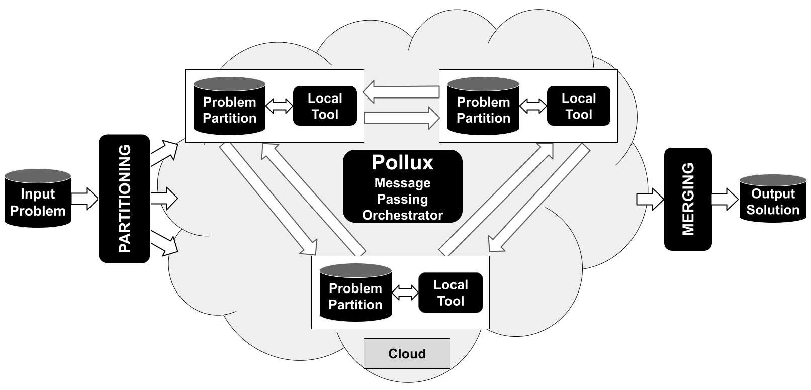
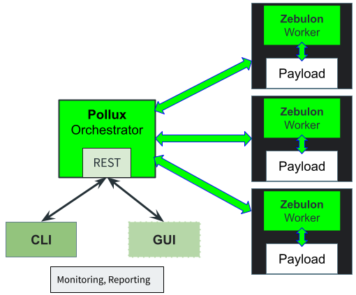

<div align="center">

</div>

---

# Pollux

**Pollux** is a Message Passing Cloud orchestrator designed to:

- distribute and manage complex algorithms, including NP-Hard and Complete problems, across multiple Cloud-based machines.
- span algorithms on the Cloud, ensuring synchronization and continuous communication among distributed components.
- ensure **robustness** by offering recover from local crash capabilities.
- take advantage of Cloud cheaper 'Spot' instances by designing Cloud distributed applications where part of the application can be killed while the overall application survives.
- support multiple payload types.
- support multiple payloads using multiple programming languages.
- support multiple payload hardwares: design applications where CPU, GPU, FPGAs, ... are collaborating live.
- offer easy reporting for algorithmic dimensioning and fine tuning.

Following video shows a [PSO - Particle Swarm Optimization](https://github.com/polluxio/pollux-payload/tree/main/src/c%2B%2B/examples/pso) application example developed using **Pollux** API. This application is available for testing (see below).


:information_desk_person: If you have any questions, send us a [mail](mailto:christophe.alexandre@getpollux.io).

:star: If you find Pollux interesting, and would like to stay up-to-date, consider starring this repo to help spread the word.

:exclamation: Pollux payload API is distributed under Apache 2 license.
Additionally, the Pollux orchestrator is made available through binary releases, which can be accessed either as direct binaries or Docker images.

---

## Motivation

In today's world many computational problems from network routing to semiconductors to AI are becoming more and more complex.

We believe that the next step for optimization of such complex grand scale computation is to leverage the massive parallelization the Cloud can offer.

We believe that this step has not been reached yet, as there is no genuine Cloud suitable framework for this type of computation; most of the frameworks used for similar purposes are actually meant for supercomputers, not the Cloud.

Our goal is to provide such a framework, designed for Cloud architecture while easy enough to use for engineers from any field.
Through a clear interface they should be able to parallelize any algorithm without being Cloud experts.

Our goal is not to treat the Cloud as a super computer, it is not.
Our goal is to virtualize a super computer on the Cloud and finally open these capabilities to a wider audience.

**Pollux**'s general principle is summarized in the following figure.



<div align="right">[ <a href="#pollux">↑ Back to top ↑</a> ]</div>

---

## Use Cases

Currently, the following **Pollux** use cases are provided:

- [Pollux payload example](https://github.com/polluxio/pollux-payload/blob/main/src/c%2B%2B/examples/test): a simple test application deploying a configurable number of workers and exchanging random messages between them.
- [Pollux PSO - Particle Swarm Optimization](https://github.com/polluxio/pollux-payload/tree/main/src/c%2B%2B/examples/pso): a [PSO](https://en.wikipedia.org/wiki/Particle_swarm_optimization) Pollux implementation (This application has been used to create the upper video).

<div align="right">[ <a href="#pollux">↑ Back to top ↑</a> ]</div>

---

## Architecture

**Pollux** is both:

- a distributed Payload API (C++ for the moment, more to come in the future).
- and a Cloud orchestrator.
The overall architecture is summarized in the following picture.


A REST API allowing users live access to the running application is under development.

<div align="right">[ <a href="#pollux">↑ Back to top ↑</a> ]</div>

---

## Building and Installing

### Getting sources

```bash
# First clone the repository
git clone https://github.com/polluxio/pollux-payload
# go inside it and init submodules
cd pollux-payload
git submodule update --init --recursive
```

If you have access to a Cloud provider (we ony support [Qarnot](#cloud---qarnot) for the moment, more to come soon), 
at this point, you are good to test pollux, locally if you have docker installed or on the Cloud if you have an account.

## Running

Running modes are managed through the **Pollux** [launcher](#pollux-launcher) '-m' option. The following modes are supported:

### Local

If you have **Docker** installed on your system, we suggest to directly use the [local docker](#local-docker) mode.

To use this mode, **Pollux** binaries need to be installed locally. We provide binaries compiled for Ubuntu
in the pollux-payload release.

If you face any compatibility issue or you need binaries for another Linux version,
please contact [us](mailto:christophe.alexandre@getpollux.io). 
Once you have downloaded the binaries (`pollux` and `zebulon`),
untar the archive in a directory and set a $POLLUX_INSTALL environment variable pointing to that directory.

```bash
mkdir pollux_install
cd pollux_install
tar xvzf pollux.tar.gz
export POLLUX_INSTALL pollux_install
```

Once this is done, run the local mode:

```bash
# Following command will launch 4 workers
python3 <pollux_payload_sources>/src/launcher/pollux.py -p <path_to_payload> -m local -n 4
```

<div align="right">[ <a href="#pollux">↑ Back to top ↑</a> ]</div>

---

### Local docker

This is the easiest mode to use to get started and a good first step to prepare for Cloud deployment.

Use the pollux test [image](https://hub.docker.com/repository/docker/polluxio/pollux-payload-examples/general)
to quickly test Pollux by running the following Pollux launcher command:

```bash
# Following command will launch 4 workers
# -c : docker image containing the payload to run as a container.
# -p : path to payload in payload container to run (usually payloads are located in /root)
python3 <pollux-payload-sources>/pollux.py -m local_docker -c polluxio/pollux-payload-examples -p /root/pollux-payload-test -n 4 
```

The following command launches the **PSO** example with 8 workers:

```bash
python3 <pollux-payload-sources>~/pollux.py -m local_docker -c polluxio/pollux-payload-examples -p /root/pollux-payload-pso -n 8 
```

<div align="right">[ <a href="#pollux">↑ Back to top ↑</a> ]</div>

---

### Cloud - Qarnot

[Qarnot](https://qarnot.com) is a Cloud provider with a unique approach to Cloud computing in which the wasted heat generated by computer servers is recycled to heat buildings.

**Qarnot** offers free trial credits accessible in a few clicks.
To try deployment on **Qarnot**, first create an account on this [page](https://tasq.qarnot.com/login/).

Retrieve your access token, save it locally ('qarnot.conf) and then launch Pollux using the following command:

```bash
#Launching on Qarnot with 3 workers
python3 <pollux-payload-sources>/pollux.py -m qarnot -c polluxio/pollux-payload-examples -p /root/pollux-payload-pso -n 3 
```

<div align="right">[ <a href="#pollux">↑ Back to top ↑</a> ]</div>

---

## Pollux launcher

To launch Pollux applications, a `Python` script launcher is provided
[here](https://github.com/polluxio/pollux-payload/blob/main/src/launcher/pollux.py).

A convenient way to proceed is to create a `Python` virtual environment. With Python 3:

```bash
apt-get install python3-venv
pip3 install virtualenv
```

In a project directory, create an environment:

```bash
python3 -m venv pollux
```

Activate it:

```bash
. pollux/bin/activate
```

Now that the environment has been created and launched, you can install the following `Python` libraries:

```bash
pip install pyyaml
#to use local Docker pollux mode
pip install docker
#To use Qarnot Pollux mode 
pip install qarnot
```

<div align="right">[ <a href="#pollux">↑ Back to top ↑</a> ]</div>

---

## Write your own Pollux payload

### Supported payload languages

Currently, only `C++` is supported. `Python` support, for instance, could easily be added (some early tests have been done).

### C++

First install following dependencies, On Ubuntu for instance:

```bash
sudo apt-get install cmake
sudo apt-get install g++
sudo apt-get install protobuf-compiler-grpc
sudo apt-get install libgrpc++-dev
```

Copy relevant files:

```bash
#create a thirdparty dir
mkdir thirdparty
cd thirdparty
git submodule add https://github.com/polluxio/pollux-payload
```

### Dockerfile

Once your **Pollux** payload is ready to be tested, in order to launch in [Local Docker](#local-docker)
or on the Cloud, you need to write your own `Dockerfile`.

This [Dockerfile](https://github.com/polluxio/pollux-payload/blob/main/Dockerfile) is the best starting point:

```Dockerfile
FROM ubuntu:latest AS builder

# Update Ubuntu Software repository
# And install needed components for your payload
RUN apt-get update && apt-get -y install \
    cmake \
    make  \
    g++ \
    protobuf-compiler-grpc

WORKDIR /my-pollux-payload
#COPY you application components
COPY cmake cmake
COPY src src
COPY thirdparty thirdparty
COPY CMakeLists.txt .
RUN cmake . && make -j$(nproc)

FROM polluxio/pollux:latest AS my-pollux-payload
#add eventual runtime libraries in below command
RUN apt-get update && apt-get -y install libgrpc++ 

WORKDIR /root
COPY --from=builder /my-pollux-payload/src/c++/my-payload
#For Pollux Communication
EXPOSE 50000
```

Once the Dockerfile written, run the folowing commands to create your docker image:

```bash
docker build --target my-pollux-payload --file Dockerfile . -t my-pollux-payload
docker tag my-pollux-payload mydockerrepository/my-pollux-payload
docker push mydockerrepository/my-pollux-payload
```

You should then be able to run your own payload by referencing it with the
'-p' switch of the **Pollux** launcher.

<div align="right">[ <a href="#pollux">↑ Back to top ↑</a> ]</div>
